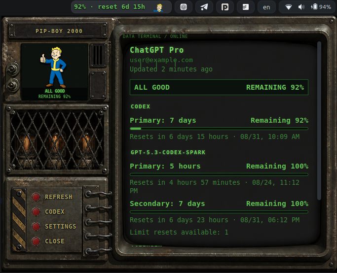

<div align="center">

<h1>☢ Agents Tray Limits</h1>

<p><strong><code>PIP-BOY 2000 // MULTI-PROFILE RATE-LIMIT MONITOR</code></strong></p>

<p>
  <a href="https://github.com/RealLeo/agents-tray-limits/releases/latest"></a>
  <a href="#requirements"></a>
  <a href="LICENSE"></a>
</p>

<p><strong>Codex and Claude Code subscription limits — always visible in GNOME Shell.</strong></p>

<p>
  <a href="#features">FEATURES</a> ·
  <a href="#install-from-a-release">INSTALL</a> ·
  <a href="#profiles-and-sign-in">PROFILES</a> ·
  <a href="#user-themes">THEMES</a> ·
  <a href="#privacy">PRIVACY</a>
</p>



<p><sub>Fallout 2 interface · selected profile: Codex · display mode: remaining usage</sub></p>

</div>

> [!IMPORTANT]
> **UNOFFICIAL COMMUNITY BUILD // LEGAL NOTICE**<br>
> This project is not affiliated with, endorsed by, or sponsored by OpenAI, Anthropic, Bethesda Softworks, ZeniMax Media, GNOME, or their affiliates. See [Licensing and artwork](#licensing-and-artwork) before redistributing the extension.

<table>
  <tr>
    <td width="33%" align="center"><strong>☢ TWO PROVIDERS</strong><br><code>CODEX + CLAUDE CODE</code><br><sub>One local monitor for both CLIs</sub></td>
    <td width="33%" align="center"><strong>▣ MULTI-PROFILE</strong><br><code>PERSONAL + WORK</code><br><sub>Isolated accounts, instant switching</sub></td>
    <td width="33%" align="center"><strong>◉ THREE INTERFACES</strong><br><code>FALLOUT 2 + FALLOUT 3 + CLASSIC</code><br><sub>From native GNOME to full Pip-Boy</sub></td>
  </tr>
</table>

Agents Tray Limits is a GNOME Shell extension that shows Codex and Claude Code subscription rate limits in the top panel. One indicator follows the selected profile, while its menu summarizes every configured profile and switches between them instantly.

<a id="features"></a>
## 01 // FEATURES

- Explicit Codex and Claude Code profiles with isolated configuration directories.
- A compact panel value such as `65% · reset 4d 22h`, calculated from the selected profile's primary window.
- A profile summary and instant switching in the Classic, Fallout 3, and Pip-Boy interfaces.
- Remaining-usage and used-usage display modes.
- Detailed primary, secondary, and additional rate-limit groups in the menu.
- Reset countdowns and optional token statistics.
- Automatic Codex CLI discovery, including NVM, Volta, Bun, pnpm, asdf, and mise installations.
- Three built-in themes:
  - `fallout-2`, the default Pip-Boy 2000-inspired theme with one-shot character animations;
  - `fallout-3`, a bright green CRT-inspired theme;
  - `classic`, the native GNOME-style fallback.
- Declarative user themes without executable theme code.
- English, Russian, German, French, and Simplified Chinese interfaces.
- Automatic system-language selection with English fallback, plus a manual language override.

The extension reports only subscription limits exposed by Codex App Server or Claude Code's documented status-line input. It does not scrape web pages, report API billing, or switch the account used by an already-running CLI session.

<a id="requirements"></a>
## 02 // REQUIREMENTS

| System component | Field requirement |
| --- | --- |
| **GNOME Shell** | Versions 45–50 |
| **Runtime** | Python 3 |
| **Codex profiles** | Codex CLI authenticated with **Sign in with ChatGPT** |
| **Claude profiles** | Claude Code with a signed-in session |

### CHECK SYSTEM VERSION

```bash
gnome-shell --version
```

### CONNECT CODEX

Install and start Codex using the official installer:

```bash
curl -fsSL https://chatgpt.com/codex/install.sh | sh
codex
```

Choose **Sign in with ChatGPT** during authentication. An API-key-only or Bedrock login cannot expose ChatGPT subscription limits.

### CONNECT CLAUDE CODE

Install Claude Code using its official instructions. The extension does not start interactive Codex or Claude sessions; it only starts the local Codex App Server and reads locally collected Claude status-line data.

<a id="install-from-a-release"></a>
## 03 // INSTALL FROM A RELEASE

1. Download `agents-tray-limits@realleo.zip` from the [latest release](https://github.com/RealLeo/agents-tray-limits/releases/latest).
2. Install and enable the extension:

```bash
gnome-extensions install --force ./agents-tray-limits@realleo.zip
gnome-extensions enable agents-tray-limits@realleo
```

3. Open its preferences:

```bash
gnome-extensions prefs agents-tray-limits@realleo
```

On Wayland, GNOME Shell may not discover a newly installed extension until you sign out and sign back in. Do not use `gnome-shell --replace`; it can terminate or destabilize the active session.

If the former `chatgpt-usage@realleo` extension is installed, disable it manually to avoid two panel indicators:

```bash
gnome-extensions disable chatgpt-usage@realleo
```

Agents Tray Limits is a separate extension and does not import the former extension's settings automatically.

<a id="install-from-source"></a>
## 04 // INSTALL FROM SOURCE

```bash
git clone https://github.com/RealLeo/agents-tray-limits.git
cd agents-tray-limits
make check
make pack
./install.sh
```

The packaged extension is written to `dist/agents-tray-limits@realleo.zip`, with a SHA-256 checksum next to it.

To update a source installation, pull the new source, rerun the checks, and reinstall:

```bash
git pull --ff-only
make check
./install.sh
```

If GNOME retains old JavaScript modules after an update, sign out and sign back in. Do not restart GNOME Shell with `--replace`.

To uninstall:

```bash
./uninstall.sh
```

<a id="settings"></a>
## 05 // SETTINGS

| Control | Terminal function |
| --- | --- |
| **Language** | System, English, Russian, German, French, or Simplified Chinese. System mode is the default; unsupported system languages fall back to English. |
| **Display** | Show either the remaining or used percentage. |
| **Refresh interval** | Select an automatic refresh interval from one minute to one hour. |
| **Panel icon** | Show or hide the state icon after the panel text. |
| **Theme** | Choose a built-in or user theme. `fallout-2` is selected on new installations; invalid or missing themes safely fall back to `classic`. |
| **Theme animation** | Disable the large menu artwork animation. GNOME's system animation preference is also respected. |
| **Detailed limits and tokens** | Show all returned limit groups and token statistics. |
| **Profiles** | Create, edit, delete, and select Codex or Claude Code profiles. Names must be unique. A non-default directory must be absolute or start with `~/`. |
| **Codex CLI path** | Explicitly select the Codex launcher if GNOME Shell cannot see your normal terminal `PATH`. |

Language changes update the panel and an open menu without requesting fresh data. Stable helper errors are translated; unknown technical details remain available in the journal.

<a id="profiles-and-sign-in"></a>
## 06 // PROFILES AND SIGN-IN

An existing single-account installation is migrated on first run to a profile named **Codex**. Its empty `configDir` means the standard `~/.codex` directory. The equivalent default for Claude Code is `~/.claude`.

Create additional profiles in the preferences window and give each one an explicit `CODEX_HOME` or `CLAUDE_CONFIG_DIR`. The provider cannot be changed after creation. Preferences show a copyable sign-in command for each profile, for example:

```bash
CODEX_HOME="$HOME/.codex-personal" codex -c 'cli_auth_credentials_store="file"' login
CLAUDE_CONFIG_DIR="$HOME/.claude-work" claude
```

Each additional Codex profile uses its own `auth.json` and forces Codex's file credential store. Agents Tray Limits never opens that file. The global **Codex CLI path** setting still applies to every Codex profile.

For a Claude profile, expand it in preferences and choose **Enable collector**. Agents Tray Limits then:

- preserves the exact existing user-level `statusLine` value;
- installs a self-contained wrapper in `<CLAUDE_CONFIG_DIR>/agents-tray-limits/statusline.py`;
- caches only Claude Code's version, update time, percentages, and reset times under `~/.cache/agents-tray-limits/claude/`;
- passes the original input to the previous status-line command and returns its output and exit status unchanged.

The first Claude limit appears after that profile makes an API request and Claude supplies `rate_limits`. Project, local, or managed settings with higher priority can override the user-level collector; in that case the cached value eventually becomes stale until that Claude profile runs with the collector active.

Removing a profile never deletes its configuration directory, history, or credentials. Removing a monitored Claude profile first restores its previous status line; a conflict is reported rather than overwriting a status line changed independently.

<a id="how-status-is-calculated"></a>
## 07 // STATUS CALCULATION

The top panel, character state, detailed limits, and token statistics use only the selected profile. Switching profiles uses already loaded data and does not trigger a new request.

For Codex, the primary window of the main Codex group drives the panel. Secondary windows and groups such as Spark remain visible in the detailed menu but do not affect the panel value or character state. For Claude Code, the documented five-hour window is normalized as primary and the seven-day window as secondary. Claude values are used only while the primary reset time remains in the future; after that the extension asks for an update from Claude instead of guessing a new percentage.

Character states are based on the **remaining** primary percentage, even when the numeric display is set to used percentage:

| Remaining | State |
| ---: | --- |
| `0%` | Dead |
| `1–20%` | Critical |
| `21–50%` | Worried |
| `51–100%` | Good |

<a id="user-themes"></a>
## 08 // USER THEMES

Place each theme in its own directory below:

```text
~/.local/share/agents-tray-limits/themes/
└── my-theme/
    ├── theme.json
    ├── theme.css
    └── assets/
        ├── good.png
        ├── worried.png
        ├── critical.png
        └── dead.png
```

A minimal manifest uses schema version 1:

```json
{
  "version": 1,
  "id": "my-theme",
  "name": "My Theme",
  "description": "A custom theme",
  "stylesheet": "theme.css",
  "art": {
    "good": "assets/good.png",
    "worried": "assets/worried.png",
    "critical": "assets/critical.png",
    "dead": "assets/dead.png"
  }
}
```

Theme IDs may contain lowercase ASCII letters, digits, `_`, and `-`; the directory name must equal the ID. The four `art` images are required. Optional `panelArt` can provide four separate panel icons. A `frameAnimation` can provide 1–32 raster frames for every state; a single frame makes that state explicitly static. It may override its base interval with `intervalMsByStatus`; the older `animation` field defines transform steps, and the two animation forms are mutually exclusive.

All manifest paths must resolve to regular raster files inside the theme directory. Absolute paths, `..` traversal, and symbolic links are rejected. User themes may override built-in IDs except for the reserved `classic` theme. Use **Reload themes** in preferences after editing a theme.

Theme names and descriptions from user manifests are displayed exactly as authored. Built-in theme metadata follows the selected interface language.

<a id="privacy"></a>
## 09 // PRIVACY

> [!NOTE]
> **LOCAL-DATA PROTOCOL** — account data stays on the machine and credentials remain under the control of the official CLIs.

For each Codex profile, Agents Tray Limits starts a separate local `codex app-server` with the corresponding `CODEX_HOME` and uses its account, rate-limit, and token-usage read methods. Authentication remains managed by Codex CLI.

For Claude, the optional collector receives the same JSON that Claude Code already sends to its configured status-line command. It discards everything except `rate_limits.five_hour`, `rate_limits.seven_day`, the Claude version, and the local update time. Collector directories and scripts use mode `0700`; caches and backups use mode `0600`.

The extension:

- does not request or store an API key;
- does not read browser cookies;
- does not store access or refresh tokens;
- does not send account data to third-party services;
- displays a Codex account email only in the local menu;
- does not read Codex `auth.json`, Claude `.credentials.json`, OAuth tokens, CLI history, or project contents.

The Claude backup contains the original local `statusLine` value so it can be restored exactly. Deleting a profile or uninstalling the extension does not delete the profile's configuration directory, history, or credentials.

<a id="troubleshooting"></a>
## 10 // TROUBLESHOOTING

Run the installed helper directly:

```bash
/usr/bin/python3 ~/.local/share/gnome-shell/extensions/agents-tray-limits@realleo/bin/agents-tray-limits-helper.py --pretty
```

A successful response includes `"ok": true`.

| Diagnostic signal | Recovery protocol |
| --- | --- |
| `codex_not_found` | Install Codex or set its path in preferences. |
| `not_logged_in` | Run `codex` and sign in with ChatGPT. |
| `unsupported_auth` | Switch from API-key or Bedrock authentication to ChatGPT authentication. |
| `codex_too_old` | Update Codex CLI. |
| `app_server_stopped` | Check that the Codex launcher uses a compatible Node.js runtime. |
| `invalid_profile_path` | Use an absolute path or a path beginning with `~/`. |
| `claude_cache_missing` | Enable the collector, then make an API request from that Claude profile. |
| `claude_limits_unavailable` | Claude did not include the documented `rate_limits` fields. |
| `claude_limits_stale` | Run that Claude profile so it can report a fresh post-reset value. |
| `claude_settings_invalid` | Repair `settings.json`; the extension deliberately did not overwrite it. |
| `claude_monitor_conflict` | The status line changed independently and must be resolved manually. |
| `timeout` | Check connectivity and retry. |

Inspect a specific profile directly:

```bash
/usr/bin/python3 ~/.local/share/gnome-shell/extensions/agents-tray-limits@realleo/bin/agents-tray-limits-helper.py --provider codex --profile-id personal --config-dir "$HOME/.codex-personal" --pretty
/usr/bin/python3 ~/.local/share/gnome-shell/extensions/agents-tray-limits@realleo/bin/agents-tray-limits-helper.py --provider claude --profile-id work --config-dir "$HOME/.claude-work" --pretty
```

`./uninstall.sh` attempts to restore every configured Claude status line before removing the extension. If the extension was removed through GNOME Extensions, the installed collector remains self-contained and can restore itself:

```bash
~/.claude/agents-tray-limits/statusline.py --restore
```

Use the corresponding `CLAUDE_CONFIG_DIR` for a non-default profile. Restoration refuses to overwrite a status line that was changed after collector installation.

Inspect current extension state and the GNOME Shell journal:

```bash
gnome-extensions info agents-tray-limits@realleo
journalctl --user -f -o cat /usr/bin/gnome-shell
```

If all user extensions were disabled after a session failure, re-enable the global extension switch and then this extension from the GNOME Extensions application. Do not run a second GNOME Shell process.

<a id="development"></a>
## 11 // DEVELOPMENT

Install the development dependencies available from your distribution: Python 3 with Pillow, Node.js, GJS, GLib schema tools, `zip`, and `unzip`. Then run:

```bash
make check
make pack
unzip -t dist/agents-tray-limits@realleo.zip
```

`make check` validates JavaScript, Python, schemas, translations, themes, UI source contracts, the helper test suite, and the deterministic Fallout 2 animation render. `make pack` creates a clean runtime archive with compiled schemas and a checksum.

The Fallout 2 theme uses a build-time layered 2D rig. The `good`, `worried`, and `critical` states use 32 frames at a 28 ms runtime interval. The seated X-eyed `dead` state is deliberately static. Every animated sequence is rendered from shared body parts with fixed joint pivots and cubic easing rather than independently generated frames. The rig sources and renderer live under `tools/animation-rig/` and are excluded from the runtime ZIP.

See [CONTRIBUTING.md](CONTRIBUTING.md) for contribution rules and [SECURITY.md](SECURITY.md) for private vulnerability reporting.

<a id="official-documentation"></a>
## 12 // OFFICIAL DOCUMENTATION

| System | Field manual |
| --- | --- |
| **Codex** | [App Server](https://developers.openai.com/codex/app-server) · [CLI](https://developers.openai.com/codex/cli) · [Authentication storage](https://learn.chatgpt.com/docs/auth) |
| **Claude Code** | [Environment variables](https://code.claude.com/docs/en/env-vars) · [Status line](https://code.claude.com/docs/en/statusline) |
| **GNOME Shell** | [Extension development guide](https://gjs.guide/extensions/) |

<a id="licensing-and-artwork"></a>
## 13 // LICENSING AND ARTWORK

Source code is available under the [MIT License](LICENSE), copyright © 2026 RealLeo.

The MIT License **does not apply** to the Fallout/Pip-Boy/Vault Boy-inspired raster artwork under `themes/fallout-2/assets/`, `themes/fallout-3/assets/`, and `tools/animation-rig/`. Those assets may incorporate third-party intellectual property. No additional rights to that intellectual property are granted by this repository. Read [NOTICE.md](NOTICE.md) before copying or redistributing a build that contains the artwork.
